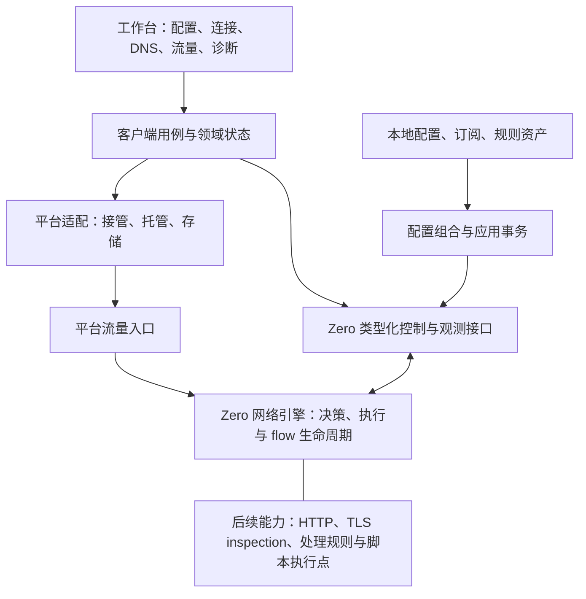

# 网络工具箱架构与现有实现迁移计划

2026-09-09。规划基于当前 Zero 与 GUI 工作区；目标是统一、可编程的网络引擎和跨平台工作台，对照 Surge 的产品组织方式，保留 Zero 自有契约。本文取代此前以独立工具集合为主轴的方案。当前已沿 P1 连接观测链、P2 配置工作区推进 P3 托管与接管治理；具体交付与验证边界见第 9 节，其余目标尚未实现。

## 1. 决策与边界

**统一流量主干、配置语义和观测契约；按职责拆分实现、状态所有权与平台依赖。**

- Zero 是网络引擎主体，现有转发、DNS、策略、TUN、flow 与诊断继续复用。未来 HTTP 检查、MITM、改写和脚本执行点沿同一主干扩展。
- “Zero 网络引擎”指多个 crate 组成的整体，不等于 `zero-engine` 一个 crate。后者继续拥有决策/控制状态，不接管 socket、监听器、协议解析和脚本运行时的全部实现。
- 客户端是配置、控制、观测和调试工作台。页面不另建一套路由、健康或配置生效事实；同时保留平台操作和客户端任务自己的状态。
- 平台层负责系统网络接入、进程/系统服务、凭据与证书存储、文件位置和桌面交互。采用明确能力接口，不以桌面进程模型规定未来移动端。
- 离线分析和独立网络检查可脱离正在运行的引擎；它们是辅助工具，不再作为整个产品的首要架构验收样板。
- 产品不运营或销售节点。Android 上架、完整抓包/MITM、用户脚本运行时及第三方插件均不属于本轮实现范围。



图表示职责关系，不规定请求处理各阶段的精确顺序或进程部署方式。引擎到平台设备的实际调用遵循当前平台抽象。

## 2. 保留什么，调整什么

| 当前实现 | 决策 | 原因与迁移约束 |
| --- | --- | --- |
| Zero 的 config/router/engine/proxy/transport/protocols/stack 分层 | 保留 | 已有协议能力注册和执行职责划分，不因工具箱定位再包装一个万能模块系统 |
| `zero-api` 的 capabilities、command/query/event、FlowRecord | 作为统一依据 | 复用版本、能力和限制描述；新 HTTP 请求记录以后关联 flow，不把 flow 直接改名为 HTTP request |
| GUI `kernel/{transport,protocol,zero}` | 收敛为 Zero 控制客户端边界 | 保留现有传输和兼容解析；去掉对全局应用状态/隐式默认端点的业务依赖 |
| GUI `KernelAdapter` 与共享库 `ClientKernel` | 按真实调用逐步收敛 | 当前前者覆盖过多职责且以多内核兼容为目标，后者尚未接入实际执行；不继续平行建设两套万能接口 |
| `AppState`、前端 `gui-state.svelte.ts` | 按所有权逐项迁出 | 配置、托管、事件会话、探测和页面状态分开；保留必要的跨操作协调，不直接把一个共享锁拆成多个失去保护的锁 |
| `rule_overlay`、`config_apply`、`profile_switch`、`domain_store` | 先整理为可测试的配置工作流 | 复用现有叠加、核对、关联存储和旧 flow 清理语义，不重写格式或改变提交顺序 |
| `core_process`、`gui_connection`、system proxy guard、TUN 操作 | 划分托管与接管所有权 | “内核运行”“控制连接可用”“系统代理/TUN 已接管”是不同状态，不能合并成一个 running 标志 |
| 已提取 `znet-client-core`、入口/托盘拆分、退出清理修复 | 保留作为迁移基础 | 共享库现有状态逻辑继续使用，不扩成中央业务核心；兼容门面在实际调用迁移完后删除 |

当前源码依据包括 Zero 的 `docs/project/{architecture,control-plane,flow-query-contract}.md`、`crates/api/src/capabilities.rs`，GUI 的 `state/app_state.rs`、`kernel/adapter.rs`、`services/{config_apply,profile_switch,capability,core_events,core_process}.rs`。这里是源码职责审查，不是安装包或真实网络验收。

## 3. 客户端首先建立的所有权边界

以下是责任单元，不要求一开始每项都新建 crate。先在真实调用链中形成私有状态和公开入口，只有依赖隔离或构建裁剪需要时再提取 crate。

| 单元 | 拥有 | 不拥有 |
| --- | --- | --- |
| 引擎控制客户端 | 传输、请求关联、Zero 查询/命令编码、兼容解析；按控制、观测、诊断等职责提供窄入口 | 页面状态、托管进程、业务配置库；也不替代内核路由决策 |
| 引擎连接上下文 | 明确端点、当前内核实例、连接代次、能力快照、事件订阅及重连生命周期 | 所有业务数据和所有模块的锁 |
| 配置工作区与应用用例 | 来源资料、本地编辑、有效配置、变更预览、提交结果与恢复信息 | 数据面执行、面板计费；不声称本地数据库与内核具有跨进程原子事务 |
| 内核托管器 | 本客户端启动的进程/服务句柄、启动参数、退出等待与恢复策略 | 未由本客户端启动的外部内核进程；关闭控制连接不代表应杀进程 |
| 平台接管控制器 | 系统代理/TUN 的操作协调、实际状态核对和所属资源清理 | 与 Zero 并存的第二套数据面；具体 TUN/路由执行仍由现有拥有方完成 |
| 观测/探测用例与前端局部状态 | flow、policy、DNS 的工具视图和客户端任务；有界缓存、取消、结果关联 | 可修改的全局内核副本、任意兄弟模块的私有状态 |

连接上下文是多个功能共享的明确依赖，不是服务查找容器，也不要求所有请求共用一根物理 IPC 连接。业务调用只取得所需入口；构造时明确端点，禁止服务各自猜测或回退到另一个内核实例。

内核报告的 `core_instance_id`、配置版本与客户端连接代次含义不同，分别保留。客户端不能用本地计数替代真实内核身份。现有 Tauri DTO 与命令名在迁移中保持兼容；Zero 的核心模型在控制边界内集中映射，页面只持有必要的展示模型。

## 4. 现有配置先形成可解释的组合链

当前优先整理“配置来源 + 现有本地设置/规则叠加 → 有效配置 → 内核校验与应用 → 核对与本地提交”。来源内容、用户编辑、叠加产物、生效状态分开保存或表达，不能把生成后的产物冒充用户原始配置。

- 先记录当前实际叠加顺序，再保持行为迁移；规则顺序、同名对象、资产引用与删除行为均需可解释。
- 组合函数尽可能对显式输入生成候选和来源说明，文件读取、数据库写入、网络请求留在用例/适配层。
- `config_apply` 已先读取身份、提交一次、再核对返回身份与当前状态；确认前不提交本地配置。回复丢失或无法核对仍是“结果不确定”，不能自动重放、默认视为失败或隐式重启内核。
- `profile_switch` 对旧 flow 的清理已有内核实例隔离，继续保留；重启后不能把旧 flow ID 当作新实例目标。
- 配置与订阅关联的数据库写入保持事务语义。内核已应用但本地落盘失败等跨边界故障要分别记录并协调恢复，不能笼统称为一次原子提交。
- 未来“配置模块”可以表达有优先级、目标能力和来源的受限配置补丁。先用当前规则叠加证明组合边界，不现在引入 `.sgmodule` 兼容、任意 JSON patch 或第二套配置语言。

## 5. 自治理与调试从现有服务收敛

复用已有日志、事件代次、重连、退出清理、IPC 调试记录和能力接口；先统一观测口径，不另起一个能控制所有业务的治理中心。

- 模块/用例输出实际状态、原因、所属内核实例和配置版本、活动任务、适用的重试/队列信息。日志关联操作与请求 ID，普通日志不打印凭据和配置正文。
- 期望状态与实际状态分开；用户停止/禁用优先于自动恢复。网络离线、内核重启、权限缺失和执行失败应能区分。
- 任务、计时器、订阅和预算有明确所有者；离开页面释放页面资源，不误停共享内核连接；停用运行模块则取消所属后台任务并等待必要清理。
- 引擎不可用是多个工具共同依赖的故障，应一致投影；一个工具解析/展示失败只影响该工具。进程内异常隔离不等于能够抵抗进程 abort 的沙箱。
- 事件是事实通知，关键命令通过结果及必要的状态核对确认；事件断流后按已有契约重新取得快照并丢弃过期代次结果。
- 替代传输、受控时间、模拟事件和失败注入用于不启动 Tauri 的用例测试；实际 Zero 的 IPC 契约测试负责证明替代实现没有偏离生产行为。

## 6. 编译裁剪与平台能力

保留 Zero 现有 Cargo feature 和能力声明。GUI 当前基本作为完整桌面应用构建，页面隐藏/Pro 模式限制不能当作编译裁剪完成。

产品组合明确选择：引擎编译能力、客户端模块、平台适配、命令、页面和资源。开始使用少量显式组合与校验脚本，只有重复维护造成实际问题后才考虑生成器。共享依赖由保留模块继续使用，不能以“裁掉一个工具”为由删除其他工具需要的 TLS 等组件。

可用性由客户端编入的功能、对端实际能力、平台支持、权限和用户启用状态共同决定。不在客户端复制一套协议支持真值；已有 `ApiCapabilities` 的契约版本、features、build_features 和 limitations 继续作为依据。未知版本或断线状态不自动解释为功能永久不支持。

首期构建矩阵：当前完整桌面组合；独立裁掉 DNS/Fake-IP 诊断与路由追踪的桌面组合（探测随后接入）；脱离 Tauri 的控制客户端/用例测试目标。裁掉工具时必须检查专属命令、前端入口、后台任务和依赖，不只检查菜单。未来 Android 再补真实平台接管/服务生命周期验收；宿主网络检查组合可以后续添加，不作为本轮重构全部现有网络功能的前置要求。

## 7. 分批落地与退出条件

| 批次 | 具体改动范围 | 完成标准 |
| --- | --- | --- |
| P0 基线与职责冻结 | 保留上一轮有效改动；记录命令/DTO、端点解析、配置应用、连接/退出行为；逐项标注迁移来源与目标 | 每个后续改动有行为基线；不以文件数量或行数作为完成指标 |
| P1 控制边界与首条观测链 | 复用 `kernel/{transport,protocol,zero}`；从业务调用中移出隐式端点，建立实例/代次作用域；贯通“连接列表/详情 + 事件/快照 + 页面” | 替代传输与真实 IPC 契约均通过；断连/实例替换时旧事件不污染新视图；页面无需直接调用底层 Zero 查询；不接管进程或配置事务 |
| P2 配置工作区 | 整理 `rule_overlay/config_apply/profile_switch/domain_store` 与对应前端用例，迁出必要状态 | 候选来源可解释；既有优先级不变；提交一次、确认后提交本地；回复丢失、落盘失败、并发切换与旧 flow 清理有回归覆盖 |
| P3 托管与接管治理 | 从 `AppState/core_process/gui_connection` 迁出资源所有权和协调接口；收敛前端连接状态 | 启动失败、重复操作、TUN 清理失败、手动停止、退出及重连均符合现有语义；不误停外部内核；跨配置/接管操作仍有完整互斥保护 |
| P4A 产品组合与裁剪（先做） | 显式组合清单、编译开关、按组合生成前端入口；先独立裁剪 DNS/Fake-IP 诊断和路由追踪，再接入其他工具 | 前后端选择一致；裁掉的工具不进入生产模块图、请求调用或专属命令注册；保留组合可构建 |
| P4B 工具自治（后做） | 沿 P1 接入 DNS、策略与探测；任务、并发预算、取消和实例状态归工具所有 | 在 P4A 已确定的组合边界内验证任务取消、实例隔离及窄执行入口 |
| P5 后续能力 | 在上述主干上新增捕获记录、HTTP 消息检查、MITM、改写和脚本执行点，按需拆成更小交付批次 | 每项先定义协议范围、生命周期、限额、失败策略与裁剪测试，不把整个能力族当成一次改造 |

每批保留暂时兼容门面，以实际迁移调用点为单位删除旧实现。没有接入生产执行链的 trait、空 crate 或只为未来存在的注册器不计交付，也不继续累积。配置/路由/TUN 等高风险行为的修改按所属仓库要求完成完整测试；改造中的服务稳定性修复单独列出复现与验证证据。

## 8. 给未来留下的扩展位置

| 未来能力 | 现在保留的边界 | 本轮不建设 |
| --- | --- | --- |
| 抓包与 HTTP 检查 | 统一 flow 身份、可扩展观测契约、记录读取与控制动作分离；以后新增 HTTP request/message 模型关联 flow | 把所有正文放入 FlowRecord/普通事件；任意字节改写的通用 Hook |
| MITM 与改写 | 可选的协议处理阶段和证书组件；失败行为由执行路径定义 | 空 TLS inspection crate、全局拦截开关或未验证的协议覆盖承诺 |
| 配置模块 | 当前配置组合的来源、顺序、冲突及能力校验 | Surge 格式兼容与任意配置补丁执行器 |
| 脚本 | 内核所属的语义执行点、输入/结果与预算契约 | 提前固定 JS/Wasm 技术或强制执行在 GUI/内核某个进程 |
| 第三方插件 | 类型化能力与数据范围、生命周期、诊断和产品能力边界 | 动态加载器、通用服务定位器、公开协议 adapter SPI、插件商城 |
| Android/其他平台 | 控制客户端、用例与平台适配分离，平台差异可描述 | 当前桌面进程/TUN 方案直接复制到移动端或宣称适配完成 |

用户配置模块、脚本扩展和工程内部模块是不同层次，不能因为名称相同共用一个注册系统。Zero 保持自有配置与控制契约，Surge 仅作为工作流和产品能力参考。脚本逻辑归属于网络处理执行点，具体执行器可以同进程受限运行或隔离执行，待真实延迟、内存、取消和平台要求验证后确定。

进一步的流量能力设计见 [流量检查与改写](./network-inspection.md)；该文若与本计划冲突，以本计划的现有实现优先、统一引擎与执行器位置未定原则为准。此前 [插件候选设计](./plugins.md) 与 [受保护配置候选设计](./protected-config.md) 只作后续议题，不约束本轮架构。

## 9. 已完成与未完成

上一轮已提取共享状态 crate、拆开装配/命令/托盘并修复退出回调倒序和 panic 中断问题。此前前端回归、类型检查与构建通过，Rust 495 项通过、0 失败、4 项忽略。这些是当时工作区的验证结果，不是本计划 P1—P5 的验收证据。

### P1：连接观测链迁移

本批生产调用链：

```text
ConnectionInspectorWorkspace
  -> features/observations/connections.svelte.ts（有界视图与增量队列）
  <- core-events.svelte.ts（应用所有的事件订阅与代次过滤）
  <- services/gui_events.rs（重连、快照恢复与事件转发）
  -> kernel/observation.rs（现有 IPC、调试帧及 DTO 的适配）
  -> crates/engine-client（查询契约、快照一致性、订阅绑定）
  -> kernel/protocol + connection + transport（具体平台 IPC）
```

- `znet-engine-client` 不依赖 Tauri、桌面 API 或实际 socket。当前公开面仅包含连接列表/详情/近期记录查询、观测快照、替代传输和订阅所有权；不把完整 `KernelAdapter` 复制到共享 crate。Zero 原始查询结果在桥接层映射为现有 GUI DTO，通用控制面尚未全部迁入。
- `SubscriptionOwner` 原子地管理选定端点和取消代次。查询由应用边界解析一次端点；事件、恢复快照和定期连接对账固定使用同一物理 IPC 连接，连接死亡后不在查询内部换成另一个连接。
- IPC 缓存按传输类型与路径区分。停止 GUI 观测只退役其所属端点；其他端点继续可用。已有进程停止的全局清理暂时保留，资源租约与托管器迁移属于 P3。
- 完整基线查询前后核对 `core_instance_id` 与 `config_revision`；中途变化则不发布。统计/策略失败保持缺失，不能伪造空快照。事件带实例标识时必须与当前基线一致；旧版无实例字段事件仍依赖绑定传输隔离。
- 保留既有命令名和 DTO，新增只读 `gui_observation_snapshot` 供应用级状态回读，避免该路径重新猜测默认端点。已有关闭连接动作使用选定观测端点，仍通过现有命令适配器执行。
- 前端连接模块拥有最多 500 条活动记录、500 条近期记录和有界增量队列。积压时压缩为完整活动投影；旧修订不会再次流入页面增量队列。重连/停止清空本轮活动投影；实例替换清除可能复用 flow ID 的内存历史，持久化诊断文件不受影响。
- 启动阶段先有界缓存事件，待后端返回代次后精确筛选；溢出产生可重试错误并清理监听器。快照同步应用连接数据，异步补查有作用域检查，并不覆盖有序事件流拥有的连接列表。

验证入口：

- `cargo test --manifest-path src-tauri/Cargo.toml --locked -p znet-client-core -p znet-engine-client`：脱离桌面依赖的共享模块。
- `pnpm test:core-events`：实际前端服务/观测状态的替代适配器测试，含代次、迟到响应、实例切换与积压恢复。
- `cargo test --manifest-path src-tauri/Cargo.toml --locked -p gui --test observation_ipc_tests`：真实 Unix socket + 生产适配器 + 合成对端，检查请求/响应配对、DTO、连接固定和端点独立退役。
- `ZNET_OBSERVATION_CORE=/absolute/path/to/zero cargo test --manifest-path src-tauri/Cargo.toml --locked -p gui --test observation_kernel_tests -- --ignored`：显式提供二进制，启动临时无入站 Zero 子进程，验证真实查询契约并清理。默认套件忽略这一项；它不等于安装包完整 E2E。
- `pnpm verify:frontend`、`pnpm verify:backend`：工作区全量回归。CI 增加共享观测 crate 和前端观测回归。

本批本地验证记录（2026-09-09，macOS，客户端 `develop` 基于 `6d822fb`）：

- `pnpm verify:frontend` 通过；最后增补的观测测试共 10 项通过，随后 `pnpm check` 零错误/零警告，`pnpm build` 通过。
- `pnpm verify:backend` 通过：508 项通过、0 失败、5 项忽略。保留原有 6 个 Rust 编译警告；忽略项包含需要外部二进制的真实内核测试。
- 真实内核测试另行显式运行并通过：使用已安装 Zero 0.0.1（`git_hash: 5032295`，SHA-256 `96f7b959cce44e7e31dbaf0f74f0b14b9a9d2dfca30b22beb02d1ba36cf34161`）启动临时无入站子进程，退出后清理。未替换用户的运行实例或安装包，也未运行 TUN/系统接管 E2E。
- 双端点 Unix IPC 测试通过。测试服务显式设置接受连接为阻塞读写，避免平台间继承 socket 标志的差异干扰断线断言。
- `git diff --check` 通过；没有创建 merge commit、提交或推送本批改动。

这条链先证明共享接口确实用于生产和独立测试。策略/DNS 状态与托管器的全局依赖仍按 P3—P4 迁移；尚未形成完整业务裁剪组合。Android、抓包/MITM、沙箱与插件运行时均未实现。Zero 工作区另有未提交开发改动，本批不修改它们。

### P2：配置组合、确认与本地发布

本批将现有实现迁入以下责任单元，保留命令名和必要的服务兼容入口：

| 单元 | 生产职责 | 边界 |
| --- | --- | --- |
| `configuration/{composition,dns,rules,route_integrity}` | 按显式输入生成有效候选，校验引用，记录层次与来源 | 不读取 `AppState`；规则文件校验通过调用方提供的验证适配器执行；不写回原始配置 |
| `configuration::Workspace` | 拥有既有配置操作互斥锁和最后一次成功组合的元数据 | 不拥有网络引擎状态、SQLite 连接或所有工具数据 |
| `znet-engine-client::configuration` + `kernel::configuration` | 提交前身份读取、单次提交、返回身份与回读确认；传输固定 | 失败不隐式重放；连接、查询编码及现有错误解析在实际 IPC 适配器中 |
| `configuration::persistence` + `znet-client-core::publication` | 关系数据提交、应用设置投影、失败后的关系数据恢复；完成后发布内存与配置变更 | SQLite 仍保证 profile/subscription 关系事务；应用设置是另一存储，不能视为跨文件原子提交 |
| `znet-engine-client::flow_cleanup` + `services::profile_switch` | 捕获全部旧 flow，确认实例，清理并报告失败/跳过 | 不使用页面的 500 条限制；不重新连接后继续使用旧 flow ID |
| `features/configuration/profile-activation.ts` | 串行执行前端准备、提交、订阅切换及提交后协调 | 平台/Tauri 操作由 `services/config.ts` 装配；后端互斥锁仍覆盖所有配置写操作的既有路径 |

组合优先级（按本次客户端覆盖规则更新）：

1. 清除此前生成的公共规则层并校验引用；保留来源规则原有顺序。仅规则模式且启用时，按绑定顺序和 ID 稳定排序，追加已校验的公共规则。
2. 以客户端 host/port 覆盖第一个可用本地代理入口，保留 tag 和其他独立监听器。
3. 移除来源 TUN，由客户端捕获生命周期负责启停与设置。
4. 用全局 DNS 替代配置中遗留的 DNS；关闭全局 DNS 时移除遗留值，保留其他 runtime 字段。
5. 公共测速地址覆盖 runtime 和 URLTest 组；在内核支持时，客户端容差覆盖来源显式值，包括 0。
6. 恢复仍然有效的 selector 成员选择。
7. 客户端绕过策略覆盖专用槽并投影所需 DNS 分流；TUN 排除网段由客户端捕获设置应用。

`proxy_config_composition_report` / `getConfigCompositionReport()` 返回最后一次成功组合的 `sourceProfileId` 和每层 `changedPaths`。未持久化的新候选可能没有来源 ID；元数据不含配置值、凭据或正文，也不表示该候选已经在内核生效。原始配置、生成候选、内核确认结果和本地发布保持不同阶段。

稳定性调整：

- 后端互斥区间扩大为“旧 flow 捕获 → 配置应用/确认 → 本地提交 → 旧 flow 清理”，防止不同切换的捕获与清理交错。前端同样将准备和提交后协调纳入串行队列。
- 旧 flow 捕获前后确认实例和配置版本；每次清理前重新确认实例，并固定原物理连接。实例变化或身份无法读取时停止余下清理。这里仍是应用级检查，当前 Zero API 没有把身份比较与 `flows.close` 合成原子条件命令，不能声称解决了服务端内部所有竞争窗口。
- 提交后的超时、断线、响应无法解析及身份回读失败明确返回 `config_apply_uncertain`；身份/版本冲突保留冲突语义。前端收到缺少结构化错误码的 invoke 失败时，也按结果不确定处理，仅重建观测，不重复提交或执行旧 TUN 布局回滚。明确拒绝仍恢复原准备状态。
- 提交后的观测或 TUN 协调失败不再走“配置提交失败”的恢复路径；仍通知配置变更并返回已提交的配置。
- 应用设置投影失败会尝试恢复关系数据，同时保留原始失败和恢复失败。热激活/更新/替换删除路径的运行态恢复失败会保留错误详情，不能默认宣称恢复成功。现有跨存储恢复仍可能失败，并未添加自动无限重试或新配置语言。

验证入口：共享 crate 的确认/清理/发布故障注入测试；`configuration::tests` 的组合优先级和元数据测试；现有规则、DNS、SQLite 关系回滚回归；`pnpm test:config-workspace` 的前端完整切换时序测试；`kernel::configuration::tests` 的真实 Unix IPC 编码、700 条旧 flow 和丢失提交响应测试。

显式真实内核验证命令：`ZNET_OBSERVATION_CORE=/absolute/path/to/zero cargo test --manifest-path src-tauri/Cargo.toml --locked -p gui --lib supplied_zero_confirms_config_application_without_restarting -- --ignored`。该测试只启动临时无入站子进程，检查配置版本推进、实例保持、无效配置被拒绝及进程清理，不操作现有用户内核、系统代理或 TUN。

本批本地验证记录（2026-09-09，macOS，客户端 `develop` 基于 `6d822fb`）：

- `pnpm verify:frontend` 全量通过；最后补充 invoke 响应丢失用例后，`pnpm test:config-workspace` 7 项通过，`pnpm check` 零错误/零警告，`pnpm build` 通过。
- 最终代码的 `pnpm verify:backend` 通过：517 项通过、0 失败、6 项忽略。保留原有 6 个 Rust 编译警告；忽略项包含需要外部二进制的真实内核测试。
- 使用已安装的 `/Users/higanbana/.config/znet-sink/core/zero` 显式运行上述隔离配置应用测试：1 项通过。此结果覆盖实际 Zero IPC 热应用契约，不代表 TUN、系统接管或安装包端到端验证完成。
- `git diff --check` 通过；没有创建 merge commit、提交或推送本批改动。

完整产品裁剪、平台托管适配和其他工具的状态收敛仍属于 P3—P4。以上模块已经接入现有执行路径，不引入动态插件加载、公共 adapter SPI 或第二套内核控制 API。

### P3：托管资源、接管恢复与运行诊断

本批已迁移生产调用链：

| 单元 | 资源与职责 | 当前边界 |
| --- | --- | --- |
| `runtime_host::Host` | 托管子进程、stderr 读取句柄、看门狗代次、启停互斥与诊断 | 只管理本客户端创建的 Child；期望运行与实际状态分开 |
| `runtime_host/{start,spawn,monitor,stop,shutdown}` | 启动准备、就绪检查、有限重试、停止与退出协调 | 现有桌面执行器；保留启动验证、5 次重试上限及稳定运行后恢复预算 |
| `capture::{connection,system_proxy}` | 系统代理接管、崩溃备份标记及恢复 | 平台命令仍由原 `services::system_proxy` 适配器执行；操作串行且恢复前重新确认所有权 |
| `capture::{tun,tun_restore,shutdown}` | 原有 TUN 恢复用例、恢复期限、退出前的实例校验与停止确认 | TUN 仍由 Zero 执行；未将桌面方案直接当成移动端实现 |
| `features/runtime/observation.svelte.ts` | 连接/TUN 观测、保存的 TUN 意图、查询错误与失效代次 | 原 `gui-state` 是兼容门面，页面继续使用相同接口；其他工具状态留待 P4 |

托管器之外的能力查询与接管协调只读取进程状态投影，不能获得 Child 或进程互斥锁。

跨配置、接管、升级和启停的原有异步互斥锁提升为应用所有的 `runtime_operation`，不再属于配置工作区；`proxy_config_operation()` 暂时保留兼容名称。托管器内部另有同步操作锁，保护实际启动准备至资源发布的完整过程。看门狗执行检查、退出处理与重启时也参与跨域互斥；退避等待不持锁。

本批修正的行为：

- 重复启动先检查已拥有的 Child，避免先导出配置再返回“已启动”。开始新启动时，在配置导出/校验之前让旧看门狗失效；手动停止即使没有 Child，也使旧代次失效。
- 看门狗不能在启停操作期间接管子进程；健康检查失败后的终止动作再次确认代次和退出标记，避免迟到检查触碰新 Child。普通状态查询只投影托管状态，退出检测由监控路径负责，正常情况下存在轮询间隔。
- 停止只退役托管子进程启动时记录的 IPC 端点，保留其他端点。停止失败保留 Child 与 stderr 句柄，供后续清理；日志落盘失败不阻止已完成停止的状态发布。
- 退出仅对托管 Child 的记录端点执行 TUN 清理，在固定连接上先核对 runtime PID；不匹配则不提交。停止命令最多一次，随后通过既有 Zero TUN 解析器确认停止且无清理错误；解析器统一处理内核 `running` 与兼容字段 `enabled`；失败/超时保留诊断并继续关闭自有进程的生命周期管道。未拥有 Child 时不向配置指定的外部内核发送 TUN 停止命令。
- 系统代理备份与变更操作串行。当前代理已被用户或其他应用改走时，丢弃过期标记，不恢复旧备份；读取失败或恢复失败仍保留备份。非 macOS panic 清理使用非阻塞锁，避免在持锁 panic 时死锁。
- TUN 恢复期限覆盖未返回的查询与启用调用。超时表示结果未确认，不能宣称远端动作已取消，也不重复提交。
- 前端销毁会同时使连接与 TUN 查询代次失效，迟到响应不能复活旧接管状态。

`core_process_status` 增加兼容字段 `host`：`desiredRunning`、`operation`、`generation`、`lastError`。它是本地托管诊断，实际进程状态仍由原字段表达；最近错误保留用于排查，后续成功不会自动抹除。TUN 原有运行状态/错误接口及日志继续提供接管诊断，本批没有新增通用模块管理面板。

验证包含托管操作竞争/代次取消/panic 后释放、仅停止自有子进程、错误 PID/响应丢失/停止未确认的 Unix IPC 故障注入、恢复调用卡住时的期限、现有连接恢复及前端延迟查询回归。真实内核验证使用隔离子进程，不变更用户当前运行实例。

本批本地验证记录（2026-09-09，macOS，客户端 `develop`）：

- 最终代码 `pnpm verify:backend` 通过：526 项通过、0 失败、6 项忽略；保留原有 6 个 Rust 编译警告。
- `pnpm verify:frontend` 通过，含 15 项 TUN 恢复/观测回归、前端类型检查与生产构建；最后更新兼容读取路径及诊断类型后，跨模式回归与 `pnpm check` 再次通过，零错误/零警告。
- 显式运行真实 Zero 隔离测试：3 项通过，覆盖监听就绪、端口冲突、生命周期管道关闭后端口释放、配置热应用、错误 PID 拒绝和已停止 TUN 的无操作清理。使用已安装 Zero 二进制，跳过需要真实订阅服务的用例。
- 真实契约测试曾发现新清理路径错误读取 `enabled` 而非内核 `running`；已改为复用现有解析器，并加入实际字段形状及“已停止但清理失败”的回归后复测通过。
- `git diff --check` 通过，`main` 仍是 `develop` 的祖先；本批未创建 merge commit、提交或推送，也未修改 Zero 内核工作区。

后续 P4 才将 DNS、策略和探测任务迁成可独立选择的工具，并完成连同专属依赖、命令和界面的实际裁剪。平台组合构建、Android、插件执行器及流量检查不在本批交付范围；桌面系统授权弹窗和真实 TUN 接管仍需安装包端到端验证。

### P3 补齐：模块诊断与前端运行工具状态

此前清单中的两项“部分完成”已补齐本轮范围：

- 调试页新增“模块状态”，汇总内核托管、配置组合、连接/TUN 观测、策略与配置节点、网络探测、DNS/Fake-IP、路由追踪和节点测速任务。支持手动刷新、复制诊断摘要、单来源失败/超时隔离及保留上次快照；读取操作不触发启停或探测。未加载与已关闭页面有明确说明，历史错误不等于当前故障。
- 配置/托管仍通过既有命令读取；前端模块通过只读诊断读者提供元数据。按需模块销毁时释放读者并保留有界摘要，旧实例不能注销替代它的新实例。摘要不读取配置正文、节点凭据或 DNS 查询结果正文；错误信息仍用于本地排查。
- `features/policies/state.svelte.ts` 拥有策略模式、配置节点、策略组、错误和刷新顺序；异步配置切换协调结束前重新确认代次，销毁后不再发布结果。原 `gui-state` 保留页面兼容入口和交互协调。
- `features/runtime/observation.svelte.ts` 补入自检、概览与能力观测；异步读回同样受生命周期代次保护。
- `features/probes/network.svelte.ts` 拥有网络探测结果、定时器与合并请求；`features/probes/jobs.svelte.ts` 拥有节点快照、直接任务投影、终态记录和事件监听器。销毁后迟到的监听注册会立即解除，旧快照和旧任务响应不再写入视图。已有探测协调纯函数迁入 `features/probes/reconcile.ts`，组件路径仅保留兼容导出。
- `features/dns/state.svelte.ts` 与 `features/routing/state.svelte.ts` 拥有 DNS/Fake-IP 与路由诊断状态和请求；页面保留输入呈现、复制反馈和确认交互。Fake-IP 查询与清理互斥，清理后的缓存读取失败不会重复提交清理动作。

这里的失效/销毁指前端结果与监听器生命周期，不宣称取消了已提交的内核任务。后端探测并发预算、执行器拆分、平台适配及真实产品裁剪仍属于 P4。本轮也没有新增动态插件注册或通用模块启停管理器。

本批验证记录（2026-09-09）：

- `pnpm verify:frontend` 最终通过，`pnpm check` 零错误/零警告，生产构建通过；新增 9 项模块状态、请求失效、监听释放和诊断容错测试纳入前端验证与 CI。
- 使用系统 Chrome 显式运行 `module-diagnostics.spec.ts`：1 项通过。生产面板使用隔离数据源，验证部分来源失败、刷新失败保留快照与 390px 宽度布局；已检查截图。浏览器自带测试版本未安装，未把该环境错误计为产品缺陷。
- `git diff --check` 通过；保持 `develop`，没有提交、推送或发布。

本轮仅修改前端和相关回归/设计文档，未改动 Rust 或 Zero 运行逻辑，因此没有重复运行后端全量测试；前一批的 526 项 Rust 与 3 项真实 Zero 隔离验证是历史记录。本轮浏览器测试不替代安装包的 TUN 接管/系统授权验证。

### P4A：产品组合与构建裁剪

当前把 DNS/Fake-IP 诊断、路由追踪、手动节点测速接入独立选择的构建入口。下一步才处理任务、预算和取消的工具自治；这里仍不代表所有客户端模块都可以独立裁掉。

| 产品 | DNS/Fake-IP 诊断 | 路由追踪 | 手动节点测速 |
| --- | --- | --- | --- |
| `desktop`（默认） | 编译 | 编译 | 编译 |
| `desktop-dns` | 编译 | 裁掉 | 裁掉 |
| `desktop-route` | 裁掉 | 编译 | 裁掉 |
| `desktop-node-probe` | 裁掉 | 裁掉 | 编译 |
| `desktop-base` | 裁掉 | 裁掉 | 裁掉 |

组合清单为 `products/desktop.json`，可按需要增加这三个 feature 的组合。`desktop-base` 仍保留桌面宿主、配置管理、连接观测、节点浏览、策略切换、内核自动测速结果和系统接管，并非最小内核或 Android 产品。

- Cargo feature 控制专属执行源文件、KernelAdapter 方法、Zero 方法、Tauri 命令函数及注册项。手动测速的队列、并发调度、超时和手动任务完成匹配放在 `services/probe/manual.rs`，不选 `tool-node-probe` 就不编译该模块。被动策略观测仍由 `services/probe.rs` 接收。
- DNS 状态与客户端配置覆盖属于基础能力；公共测速 URL 和 URLTest 自动选择设置不随手动测速工具裁掉。
- 前端按组合生成工具入口。DNS 与路由各自拥有 Panel、状态与 client 调用文件；`features/node-probes` 拥有手动任务投影和请求，`features/nodes` 保留基础节点屏幕状态。节点页面通过可选回调组合测速按钮，未选择时不实例化测速 owner、不监听手动任务事件、不显示测速入口。
- 模块诊断只列出已选择的工具。`product-composition.json` 记录进入生产产物的模块路径，构建拒绝已裁目录通过其他入口泄漏；产物检查核对保留模块和专属 invoke 字符串。
- 这三个工具当前没有独占的第三方 Rust 依赖，JSON、IPC、Tokio 等仍被基础能力使用。本轮验证了专属实现和入口的裁剪，没有制造空 crate 或声称共享依赖也被删除。后续有独占依赖时，将 optional dependency 接到 feature 并验证 Cargo 依赖图。
- Client Core 的历史观测与任务 DTO 仍是共享契约。本轮未重做任务治理，也未把客户端编译选择变成 Zero 内核权限隔离；通用 IPC 调试桥仍是已有的专业模式能力。

```sh
pnpm product check desktop-base
pnpm product dev desktop-node-probe
pnpm product build desktop-route
```

`product` 入口把同一个 `ZNET_PRODUCT` 传给 Tauri 的前端钩子和 Cargo，并关闭默认 features 后选择工具。默认命令保留完整桌面行为。只验证前端时使用 `ZNET_PRODUCT=desktop-base pnpm build`，然后运行 `node scripts/check-product-artifact.mjs desktop-base`。

构建拒绝未知产品、前后端功能不一致，以及 release 嵌入旧组合的前端产物。切换开发组合需重启 dev server；不同组合不能同时写同一份 `build` / `.svelte-kit`。CI 覆盖五组合的前端构建、产物核对、Rust 编译及工具/节点页面浏览器验证。

配置优先级已调整为来源优先、缺失补齐、显式选择才覆盖，见 [客户端配置优先级](./config-precedence.md)。工具自治、独占第三方依赖样例、Android 托管、安装包真实授权/TUN 和长期稳定性仍需后续推进。

本轮验证（macOS，2026-09-09）：

- `pnpm verify:frontend` 全量通过，Svelte/TypeScript 0 错误、0 警告。五组合生产构建及产物模块图/专属命令检查通过，输出恢复为 `desktop`。
- 五组合 `cargo check --workspace --all-targets --no-default-features`（按产品选择 features）全部通过；日志为 `/tmp/znet-final-cargo-desktop*.log`。`cargo fmt --all -- --check` 与 `git diff --check` 通过。
- Chrome：完整组合的工具/节点、端口和公共 URL 设置 5 项通过；全裁剪组合的工具/节点与 TUN 设置 9 项通过。
- Rust 工作区各套件合计 530 项通过、6 项忽略。其中工作区完整调用曾在旧内核预检查的临时 shell 启动阶段超时（529 通过、1 失败），随后该用例单测和整个 GUI lib 套件重跑均通过（398 通过、4 忽略）。此前一次 TUN 关闭确认失败也在后续套件中通过；未增加超时或跳过断言。不能将这记录成首轮完整命令一次通过。
- 日志：`/tmp/znet-final-front2.log`、`/tmp/znet-final-build-desktop*.log`、`/tmp/znet-final-browser2.log`、`/tmp/znet-final-base-browser.log`、`/tmp/znet-final-rust3.log`、`/tmp/znet-final-lib-rerun.log`、`/tmp/znet-preflight-after-build.log`。Rust 仍有平台条件代码和裁剪后未引用的通用错误构造器警告。
- 该阶段验证时未提交、未推送，未修改 Zero 工作区；安装包及真实授权/TUN 接管未验证。

### P4B 第一批：测速执行资源归实例所有（2026-09-09）

`services/probe/runtime.rs` 的 `ProbeRuntime` 现在由各自的 `AppState` 持有，
取代进程全局的测速并发池和策略操作记录。手动节点测速与策略测速共用该实例
的 8 个并发额度；完成事件匹配、取消和超时清理均访问同一个 owner。
`tool-node-probe` 未选中时，owner、字段和访问入口一起裁掉。

本批只收敛执行资源的所有权，不宣称工具自治全部完成。任务账本仍由 Client Core
管理；已提交内核请求的取消、排队任务的即时释放、执行任务的销毁和预算诊断
仍待下一批迁移，不把忽略迟到结果等同于中止内核执行。

模块诊断页同时调整为最多三列、受限宽度的卡片布局，显示状态计数，长配置路径
单独占行；当前错误展开、历史错误折叠。读取仍不触发内核或网络操作。

验证包括测速与历史记录的 15 项 Rust 测试（含独立实例预算、相同任务 ID
隔离及 IPC 测速地址覆盖），`desktop-base` 无工具构建检查、3 项产品组合测试，
以及模块状态页的响应式、明暗主题、滚动访问和刷新失败快照保留检查。

### 当前配置的本地修改（2026-09-09）

来源配置、客户端缺省值和本地修改分别保存。用户直接修改并应用，只记录当前配置的变化字段；六项覆盖开关已撤掉。
端口、系统代理、测速、DNS、TUN 和规则组合使用统一解析语义；详情见
[配置优先级](./config-precedence.md)。切换配置若改变已开启的 TUN 参数，
当前要求先关闭 TUN，避免静态配置成功而设备仍使用旧参数。

本批 macOS 验证：第一次修正迁移测试后，Rust 工作区串行完整调用 544 项通过、
6 项忽略，无过滤用例。后续补充监听地址/连接地址分离等收尾改动后，最新完整
调用为 GUI 412 项通过、1 项失败、4 项忽略：原有候选内核预检查临时脚本再次
超时，不能将最终调用记录为全绿。新本地修改专项 6 项均通过。
基础裁剪 Rust 编译、产品组合、工具 owner、DNS 和设置导入导出检查通过。
13 项浏览器测试覆盖字段修改、恢复、失败与停止态提示、测速及 TUN 页面，
Svelte/TypeScript 检查通过。没有运行生产安装或改变真实 TUN/系统代理。

## 参考

- [Surge 运行模型](https://manual.nssurge.com/getting-started/how-surge-works.html)
- [Surge 配置模块](https://manual.nssurge.com/profile/module.html)
- [Surge 脚本执行](https://manual.nssurge.com/scripting/overview.html)
- [Surge 平台差异](https://manual.nssurge.com/getting-started/platform-differences.html)

### P4B 第二批：手动测速任务自治（2026-09-09）

手动节点与策略测速的账本已从 `ClientCore` 移入独立的 `ProbeJobs` 状态机，
由 `ProbeRuntime` 持有。宿主提供配置/内核代次、转交观测历史与 UI 更新；
工具自己管理排队、执行额度、取消通知、策略操作 ID 和截止时间。
本批优先把一个现有工具闭环，不增加统一插件管理器。

- 每个客户端实例最多 8 个并发请求、256 个待完成目标；重复活动请求去重，
  容量满时返回 `probe_queue_full`。策略组请求内部的成员并发仍由内核决定。
- 节点页提供“停止测速”：立即停止当前配置的排队目标。已提交请求继续占用额度，
  等响应/事件或截止时间，不把客户端取消标记解释为内核已取消。
- 关闭节点页只释放前端监听，后台继续运行；重新打开从后端快照恢复。
  切换/修改配置使旧任务失效并停止队列；旧结果不写入新配置。内核失联/重启
  另外清除旧策略操作等待。执行租约离开作用域时清理记录并归还额度。
- 模块诊断直接读取后端队列、执行、停止后等待数量与预算；无需先打开节点页。
  删除两个已无前端使用且绕过账本的旧手动命令 `gui_probe_target`、`gui_probe_policy`，
  手动入口统一为 `gui_probe_job_start`。诊断读取和 UI 入口同样跟随构建组合裁剪。

**边界**：当前内核没有相应的取消接口。返回超时也不证明内核任务已经终止；
这里限制的是客户端请求占用，并明确显示无法中止已发送请求。任务跨页面存续，
不跨客户端进程恢复。DNS 与路由诊断尚未迁入后端自治执行器，仍是后续批次。

本批 macOS 最终串行 Rust 工作区验证为 **551 项通过、6 项忽略**（无过滤）。
初次并行调用在原有 `healthy_ipc_for_another_pid_is_rejected` 用例失败，
其紧接着的单独复核也失败；最终串行全量中该用例通过，保留此不稳定记录。
`desktop-base` 编译检查、Svelte/TypeScript、11 项工具状态测试、4 项产品组合测试、
节点视图/测速状态/选择参数测试，以及 Chrome 的停止测速与模块诊断两项测试通过。
未构建或安装正式包，未进行真实 Windows/Android 运行验证。
