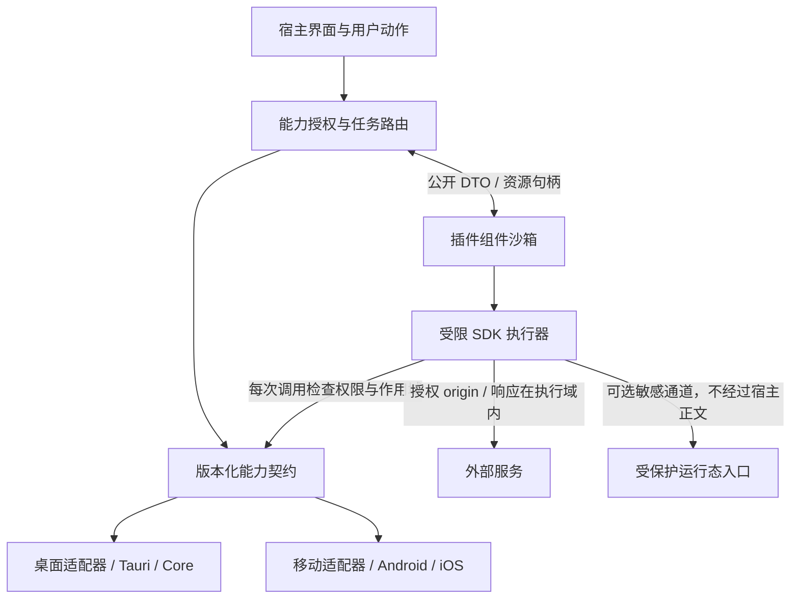

# 通用客户端插件系统：能力、沙箱与跨平台契约

状态：候选方案留档，暂不实施。2026-09-08。当前选择 [内部模块化与稳定性](./internal-modules.md)，本文不再代表已批准的实现范围。以下保留通用插件契约供未来需求成立时参考。

2026-09-09：产品定位已扩展为网络工具箱。后续插件可提供流量分析、协议展示和受限处理能力，相关实时执行、正文权限及故障策略见 [流量检查与改写边界](./network-inspection.md)。此方向尚未形成可用 SDK 或已批准的插件运行时实现。

最新规划以 [现有实现迁移计划](./internal-modules.md) 为准：配置模块、网络处理脚本与工具插件分别设计，不能混成同一个模块注册系统。本文的 SDK、执行角色和部署分层仍为旧候选，不据此固定未来脚本执行进程或要求本轮实现插件框架。

## 1. 设计决策

1. **能力优先**：插件通过稳定 SDK 使用业务能力，不调用 Tauri invoke、内部 Rust 服务、数据库或原始内核 IPC。
2. **默认无权**：按插件组件授予数据读权限、操作权限、资源范围和有效期；安装包不等于取得权限。
3. **独立沙箱**：每个组件独立运行上下文和授权域，不因属于同一插件就共享内存、存储或权限。
4. **跨平台契约一致**：平台差异在宿主适配器，插件不依赖进程、文件路径、WebView 或后台常驻。能力缺失明确返回不可用，不能静默扩大权限或降低保护。
5. **使用简单**：TypeScript SDK、类型化 manifest、模板、声明式 UI、模拟宿主与一键打包验证；用户按功能授权，避免逐次确认日常读取。
6. **秘密按角色流转**：宿主可保存账号认证信息；配置密钥由面板管理和按会话下发，授权插件在自身隔离执行域解密并直接注入运行态，密钥/明文不返回宿主业务层。

“宿主”指客户端账号、UI、持久化和业务编排层；“沙箱执行域”包括插件及其受限 SDK 执行器。移动端两者可能处于同一个 OS 进程，逻辑隔离不等于进程级内存隔离，也不承诺抵抗管理员调试或被修改的程序。

## 2. 分层架构



| 层 | 拥有的责任 | 不拥有的责任 |
| --- | --- | --- |
| PluginManager | 包、版本、启停、隔离域、资源预算和恢复 | 面板业务及协议加解密 |
| CapabilityBroker | 身份、授权、句柄、并发/版本检查、任务回执 | 解析任意插件私有业务配置 |
| 平台适配器 | Tauri/原生权限、存储、网络、代理/VPN 生命周期 | 向插件透传原始平台 API |
| 插件组件 | 已授权的转换、接入、工具与业务扩展 | 接管宿主核心状态和退出清理 |
| UI renderer | 安全组件渲染、固定授权/确认界面 | 执行插件 HTML、JS 或任意 CSS |

Tauri 的 Rust/Kotlin/Swift 构建期插件用于实现平台适配器，与用户安装的业务插件分开。Tauri 移动扩展支持 Kotlin/Swift，但不意味着下载的业务插件可以装入任意本机代码。[Tauri 移动插件](https://v2.tauri.app/develop/plugins/develop-mobile/)。

## 3. 插件组成与运行形式

一个包可声明 `commands / views / providers / processors / eventHandlers`。这些是贡献点，不自动产生授权；后续可增加贡献类型，不扩张旧能力含义。

包内组件分为普通 `extension` 和可选 `protected-executor`，每个组件独立清单、入口、运行上下文和权限集合。界面是宿主渲染的贡献项，不是第三方 WebView。组件间不直接发消息；需要协作时由宿主验证结构和作用域后传递允许字段或句柄。

默认开发入口选择 **TypeScript 编译为 JavaScript，运行于不含 DOM/Node/Tauri 的嵌入式沙箱**。脚本仅从已验签包加载，不允许远程 import、eval 动态代码或附加动态库。默认实现验证 QuickJS 类可嵌入解释器，避免把 JIT/独立子进程作为跨平台前提；执行器具体版本在原型验收后锁定。

SDK 契约以版本化方法、JSON schema 和资源句柄为准，不绑定某个解释器、Rust ABI 或 Wasm Component 实现。Wasm 可作为后续计算组件执行器，必须复用同一能力和授权语义；普通脚本无需改写为 Rust 才能开发插件。

QuickJS 提供内存、栈及中断控制接口，这些是实现沙箱预算的工具，不能替代宿主能力限制或原生回调超时。[QuickJS 嵌入接口](https://bellard.org/quickjs/quickjs.html)。

桌面优先将沙箱执行器放到独立 worker，增加崩溃隔离；移动端可使用专用执行线程/系统允许的容器。同进程执行只能承诺 VM 和 API 隔离，不能承诺原生运行时漏洞/OOM 不影响宿主。若某敏感角色要求进程/容器隔离而平台不能满足，该角色不可启用，不能把要求悄悄降为普通线程。

## 4. 可读数据边界

所有接口默认只访问用户绑定的资源；调用者自己提供账号 ID、文件路径或 pluginId 不构成授权。

| 能力 | 可以读取 | 不能读取 |
| --- | --- | --- |
| `plugin.self.read` | 自己的版本、设置、授权快照、运行状态 | 其他插件配置、宿主内部服务 |
| `accounts.metadata.read` | 绑定账号的公开 ID、昵称、套餐、额度、有效期 | 密码、登录/续期 token、其他账号 |
| `profiles.metadata.read` | 被选配置的名称、来源、版本、能力标记 | 配置正文、原始链接和凭据 |
| `profiles.content.read` | 单独授权的普通本地配置正文 | protected 来源；权限再大也不降级该来源 |
| `nodes.metadata.read` | 所选配置的节点别名、分组、延迟、状态、不透明 ID | protected 节点端点、认证材料 |
| `traffic.summary.read` | 授权账号/配置的汇总流量与速率 | 逐连接目的地址、原始数据包 |
| `connections.metadata.read` | 用户另行授予的连接元数据，按来源投影 | 原始 payload、受保护上游端点/凭据 |
| `logs.summary.read` | 允许范围的结构化诊断摘要 | IPC/HTTP 正文、其他插件日志和秘密 |
| `storage.self.read` | 本组件自己的 KV | 宿主数据库、其他组件/插件数据 |
| `files.selection.read` | 用户文件选择器授予的指定文件句柄 | 任意路径、递归扫描、隐式同目录访问 |
| `clipboard.read` | 当前用户动作的一次性读取结果 | 后台持续监听；无系统授权时也不可读 |
| `secrets.session.receive` | 敏感角色从绑定端点接收的临时秘密，限本执行域 | 通用账号 token、其他组件秘密、宿主可序列化返回值 |

公开 DTO 是字段允许列表，不通过删除几个 password 字段生成。新增字段默认不暴露。protected 来源限制在所有查询、事件、导出、错误和缓存路径一致生效。

## 5. 可执行操作边界

| 能力 | 可以操作 | 强制边界 |
| --- | --- | --- |
| `ui.contribute` | 插件页面、卡片、表单、命令入口 | 不能覆盖宿主登录/授权/连接恢复界面 |
| `network.http` | 授权 HTTPS origin、方法、路径模板与参数 | 不能访问任意 URL、raw socket、监听端口 |
| `credentials.use` | 为绑定账号/用途执行受限认证请求 | 返回凭据句柄，不返回通用登录 token；不能改 origin/用途 |
| `storage.self.write` | 自己的有界 KV | 不写受保护密钥/明文，不传真实路径 |
| `files.selection.write` | 用户选择的目标文件、一次性保存 | 不覆盖任意宿主文件；禁止 protected 数据导出 |
| `clipboard.write` | 用户动作授权的公开内容 | 不能输出受保护数据；后台写入不默认开放 |
| `profiles.draft.create` | 生成普通配置候选草稿 | 不改变活动配置，不获得已有正文读取权 |
| `profiles.apply.request` | 提交授权配置的应用意图 | 宿主校验、预览/已有自动策略、版本检查和事务提交 |
| `rules.draft.create` | 生成类型化规则草稿 | 校验引用、能力、大小；不能改其他来源的受保护策略 |
| `nodes.select.request` | 按不透明 ID 请求节点切换 | 宿主核对配置/内核实例/当前能力 |
| `diagnostics.probe.request` | 请求指定节点的受限测速 | 不能任意探测内网地址、读取协议凭据 |
| `connection.request` | 用户动作触发连接/断开意图 | 宿主拥有系统代理/VPN/TUN及恢复；后台连接需独立授权 |
| `notifications.post` | 有界通知 | 遵守系统权限和用户偏好，不能伪造系统授权提示 |
| `events.subscribe` | 订阅允许的事件类型与资源 | 投影后传递、背压/丢弃可见，不提供全局原始总线 |
| `tasks.schedule` | 注册受限后台任务意图 | 平台尽力调度，不承诺精确时间、常驻或睡眠期运行 |
| `crypto.session.use` | 在本执行域使用会话秘密执行约定算法，输出 SensitiveBuffer | 导出到宿主、长期保存密钥、跨账号复用秘密句柄 |
| `runtime.protected.load` | 敏感角色把内存配置提交到授权运行实例 | 配套敏感通道、runtime-only、无回读/落盘；不授予通用 IPC |

永久不开放通用 `invoke(command,args)`、SQL、shell、任意进程/动态库、任意文件系统、环境变量、Tauri AppHandle、原始 Core 配置控制面或直接 VPN/TUN 操作。需要新业务行为时增加有独立输入/结果和权限的语义能力。

平台能力使用 `supported / permission_required / unavailable` 与原因返回。插件可以降级自己的 UI，但不能自动换一条权限更大的实现路径。

`network.http` 不自动包含 `secrets.session.receive`：被登记为密钥/凭据响应的端点只能交给对应敏感角色，不能换普通 HTTP 方法绕过。纯数学/普通字节加密不需要敏感权限；`crypto.session.use` 专门控制受限秘密句柄的使用。

## 6. 授权、句柄与组合规则

授权主键为 `(pluginId, componentId, packageDigest, accountBinding, capability, scope, grantEpoch)`。scope 包含具体账号/配置、origin/endpoint、文件句柄、事件类型等；宿主签发的不透明句柄绑定这些信息，插件不能自行构造或跨组件转让。

有效权限 = 平台/执行域支持 ∩ 清单声明 ∩ 用户授权 ∩ 当前绑定/租约。每次调用、结果交付和操作提交均核对，不能只在启动时检查。

- 安装展示核心/可选功能；初次绑定账号/资源时授权。普通重复查询不反复弹窗。
- 一次性文件/剪贴板授权随用户动作到期；账号数据读取可持续授权；后台操作需明确持久策略。
- 更新增加权限、改变 origin、秘密用途或敏感角色时重新授权；不能继承新权限。发布者换 key 单独处理。
- 撤权、注销、停用、升级或账号切换递增 epoch，先使权限失效，再取消任务；晚到回调不能写入。
- 多个组件权限不取并集；不能用“同一插件里的另一个组件有权限”代办未授权操作。
- 所有敏感权限组合由宿主校验，manifest 不能自行允许。`runtime.protected.load` 所在组件不能同时获得文件/剪贴板写、自由 UI、通用日志、私有 KV 明文写或任意网络 egress。

网络作用域逐跳检查重定向、DNS 与实际连接目标；默认禁止 loopback/link-local/私网，自托管面板需明确授权 origin/网段。凭据不能在跨源重定向中携带；错误正文默认不记录。HTTP adapter 位于相应执行域，敏感响应不能为了复用宿主网络层而先进入宿主业务内存/日志。

## 7. 敏感执行角色

通用沙箱只能限制插件接触什么，无法让一个已经被授权读取明文的恶意插件“忘记”明文。敏感角色需要可信发布者、代码审查、签名和严格的输出接口，不能靠权限名宣称已阻止任意信息外带。

`protected-executor` 是可选高信任组件，按授权可使用会话密钥响应、执行解密和 `runtime.protected.load`。它只向宿主返回固定阶段、错误码、操作 ID、签名租约及版本；无任意字符串日志/界面字段。UI 展示元数据来自独立签名的公开投影，不能直接使用敏感执行器生成的自由文本。

敏感角色只可与绑定服务的配置/密钥端点通信，不与同包 UI 组件共享堆、KV 或消息队列；返回通用数据对象会被拒绝。错误详情保留在受限执行域并清理，宿主仅得到安全错误码。

对于 ZBoard：宿主持有账号和登录状态；面板持有配置密钥并下发短期解密材料；插件敏感组件内存解密，直接调用授权运行态入口。宿主不持有配置密钥/正文，插件不持久化密钥；该场景的完整契约见 [ZBoard 受保护配置](./protected-config.md)。

## 8. 沙箱与资源控制

| 维度 | 统一要求 | 桌面/移动适配 |
| --- | --- | --- |
| 语言环境 | 无 DOM、Node、Tauri、默认网络/文件/环境变量；只导入 SDK | 使用独立 VM；不能仅创建 JS context 后挂全局宿主对象 |
| 计算 | 运行指令/时间预算、可取消、栈/堆上限 | VM 中断；原生 SDK 调用另有 deadline，不依赖脚本主动 yield |
| 并发 | 每组件串行执行，有界事件/任务队列 | 平台决定全局并发上限；不得在 UI 主线程执行插件 |
| IO | 请求/响应/包/存储/日志限额，速率限制 | SDK 在分配大缓冲区前检查；原生解析/解压也受控 |
| 生命周期 | 启用不等于常驻，任务/资源由宿主管理 | 桌面可 worker；移动端可暂停/终止，恢复时重建上下文 |
| 故障 | 超时终止任务，重复异常隔离组件 | 桌面可终止进程；移动端标明同进程故障边界 |
| 秘密 | 不落盘、无 Debug/普通序列化、主动清零 | 敏感缓冲区由 SDK 分配；不能承诺普通 JS GC 会可靠擦除副本 |

JS 实现不安装 `std/os/Worker`、原生模块加载器及动态代码构造入口；模块解析仅接受包内已登记源码。不同组件使用独立 VM runtime，不能只在共享堆里建多个 context。拒绝插件提供的引擎字节码/内存快照，若使用缓存，由宿主从验签源码编译并绑定引擎版本与包摘要。SDK 原生对象每次调用都绑定真实组件身份，不信任客体字段。

初始测试预算建议：每普通组件 32 MiB VM 堆、单次纯计算 2 秒、HTTP 15 秒、队列 32 项、KV 1 MiB、普通消息 1 MiB。大配置/文件使用单独授权的有界流或 SensitiveBuffer，不提高整个消息总线限额。预算是原型起点，宿主最终可提供更小平台配额，插件只能申请不能自己扩大。

移动端后台能力由 OS 和宿主决定。暂停时取消在途任务、释放短期秘密，恢复后重新授权/取钥；网络/VPN 生命周期由宿主系统服务承载，不依赖插件 JS 定时器。若不能建立不经过宿主正文的敏感注入路径，普通插件能力仍可交付，受保护加载明确不可用。

## 9. 开发者与用户体验

提供 `plugin create/dev/test/pack/verify` 工具与 TypeScript 类型，至少包含账号面板、纯数据转换、声明式工具三种模板。开发模式使用模拟账号/网络/内核，不向未签名代码提供生产秘密。包内静态依赖在构建时打包，运行时不联网安装依赖。

拟议开发接口示意（不是当前可运行代码）：

```ts
export default definePlugin({
  commands: {
    async showUsage(ctx) {
      const account = await ctx.accounts.getMetadata(ctx.bindings.account);
      return ctx.ui.card({ title: account.displayName, text: account.usageLabel });
    }
  }
});
```

UI 用宿主支持的 page/card/form/table/chart/action schema，主题、语言、尺寸和无障碍一致适配桌面/移动端；禁用任意 HTML/JS/CSS，动态字段和动作做 schema 校验。标准页面布局能自适应窄屏，无需维护独立 Svelte 页面。高级自由 WebView 留作独立能力设计，不能成为基础插件必需条件。

用户在插件详情看到“读取绑定账号套餐”“访问此面板”“管理指定配置”等实际功能，展开可查看精确 scope。插件管理支持安装、授权、启停、升级、回退、卸载及“禁用全部插件”恢复模式。授权和关键确认由宿主固定界面完成。

## 10. 包、升级与任务契约

包使用签名 manifest + 资源散列，包含 `id/version/apiVersion/clientVersion/components/contributions/requiredCapabilities/optionalCapabilities`。每个 component 独立 entry、role、权限和最低隔离要求；origin 等动态作用域通过安装/账号绑定解析并授权，不能由脚本偷偷改写。

宿主可信 key 绑定发布者及可发布的 ID，包内 key 不自证身份。拒绝未知能力/版本、路径穿越、符号链接、重复路径、压缩炸弹及未列明负载。manifest 签名覆盖原始字节与资源散列；桌面/移动通用脚本包不含可下载本机程序。

任务携带 `operationId, componentGeneration, grantEpoch, resourceRevision, runtimeInstance, deadline`。写入前再核对作用域，过期结果拒绝。相同操作 ID 不执行第二次副作用；超时返回 uncertain 时通过查询回执恢复，不自动换路径重放。该机制不声称在没有持久回执的外部系统上实现 exactly-once。

事件是经过权限投影的增量 DTO，含序号/版本；缓冲溢出返回 resync_required，由插件重新读取允许的快照。禁止原始配置/密钥进入通用事件总线。

包安装与数据迁移先 staging，试运行仅访问隔离数据，提交版本指针后激活；崩溃恢复按操作记录处理。回退包及兼容设置不恢复旧授权、已撤销账号或过期配置。使用宿主存储抽象，公共契约不要求 SQLite 或桌面目录。

## 11. 平台能力矩阵

| 能力 | 桌面 | Android / iOS 契约 |
| --- | --- | --- |
| 脚本、声明式 UI、账号、HTTP、私有 KV | 基础能力 | 基础目标能力，系统权限/网络状态可限制 |
| 文件/剪贴板/通知 | 用户授权和系统适配 | 通过平台选择器及系统权限；可返回 unavailable |
| 后台任务 | 可由宿主调度 | 尽力执行，可能被延迟/取消，不承诺常驻 |
| 代理/连接动作 | 现有 Core + 系统代理/TUN | 由宿主 VPN/网络服务适配，插件不直接调用平台网络扩展 |
| 受保护配置注入 | 独立执行域到 Core 敏感通道 | 必须验证运行态容器、内存通道及权限；不默认宣称已支持 |
| 下载新插件 | 签名分发 | 受分发渠道策略约束；同契约允许随包内置/审核分发 |

API 可移植不等于每个平台/商店允许相同交付形式。iOS 插件及原生能力桥接需按实际分发场景核验规则；保留同 SDK 的内置插件方式，不能把“可动态下载并暴露任意原生 API”写为既定能力。[Apple 插件分发规则](https://developer.apple.com/app-store/review/guidelines/)。

## 12. 与当前代码的衔接及验收顺序

当前 GUI 基线 `6d822fb`。`lifecycle::OnPhase` 只接入宿主初始化，第三方任务不进入同步启动链；`client_core::ClientScope` 的版本思想可复用，但不让 SDK 依赖 Tauri。导航来自 `gui_interaction_surface_snapshot`，平台 commands 是私有适配器，不是插件 API。

普通配置继续现有服务；受保护配置不能调用会写 SQLite content、导出启动 JSON或捕获 IPC 正文的普通路径。Core `config.apply_runtime` 可作为桌面实现基础，不能决定通用 SDK 形状。Tauri capability 是窗口权限，不能替代逐插件授权；当前应用 commands 的权限还需按敏感入口收紧。[Tauri capabilities](https://v2.tauri.app/security/capabilities/)。

建议代码先分为平台无关 `plugin-contract / plugin-policy / plugin-runtime` 与 `desktop/mobile adapters`；Tauri `lib.rs` 只装配。JS SDK、schemas、模拟宿主与 conformance tests 独立发布，ZBoard 插件单独实现与版本化。

1. **契约验收**：冻结首版能力、scope、组件隔离、错误/事件/任务语义；用普通工具和 ZBoard 两类插件证明框架没有面板特例。
2. **沙箱验收**：越权、跨组件访问、撤权后回调、无限循环/递归、内存和输出洪泛、网络/文件绕过；至少桌面与一个移动原型跑同一组契约测试，并验证 iOS 非 JIT 执行/分发路径。
3. **平台与体验验收**：安装/授权/升级回退、窄屏/语言/主题、暂停恢复/离线/系统拒绝权限；插件失败不影响手动断开。
4. **ZBoard 验收**：面板发钥、插件内存解密、直接注入、宿主无配置密钥/正文、明文旁路关闭；配套具体方案独立记录。

当前只交付设计，不宣称沙箱或加解密已实现。实施时运行客户端 `pnpm verify`，增加契约/沙箱/移动生命周期测试；涉及 Core 行为时运行其 workspace 全套检查。

## 13. Git 基线

已确认客户端在 `develop`，fetch GitHub/GitLab 后，`main/develop` 与两端对应远程分支均为 `6d822fb`，fast-forward 检查通过，双向差异为 0/0。设计和后续实现保持顺序提交；同步使用 `--ff-only`，分叉时仅 rebase 未共享提交，不生成同步 merge commit、不擅自 force-push。
